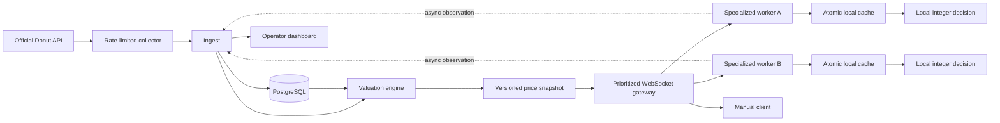

# Donut Network

A production-minded implementation of a low-latency, Cofl-style DonutSMP market network. It includes an official API collector, robust valuation engine, compact realtime snapshots, distributed observations, dynamic worker assignments, telemetry, a functional operator dashboard, PostgreSQL schema, load test, and a Fabric auction observer.

Normal startup is live-data-only and begins empty. The simulator is an explicit test profile and never starts by default. Purchase automation remains disabled until a real, validated Minecraft adapter is implemented; the project contains no anti-cheat bypass, packet exploit, stealth, ban evasion, or account abuse behavior.

## Architecture



See [docs/architecture.md](docs/architecture.md) for boundaries and data flow.

## Quick start

Prerequisites: Docker Desktop with Compose.

```bash
docker compose up --build
```

Open <http://localhost:3000>. The dashboard will be empty until authenticated Donut data arrives. Backend health is at <http://localhost:8080/healthz>. Operator projections and Prometheus metrics require the admin bearer token; the dashboard keeps that token in its server-side proxy.

To ingest live auction data, create an API key in-game with `/api`, put it in the process environment, and enable the live collector profile:

```bash
export DONUT_API_KEY='your-key' # PowerShell: $env:DONUT_API_KEY='your-key'
docker compose --profile live up --build
```

Stop with `Ctrl+C`; use `docker compose down` to remove containers. Add `-v` only when you intentionally want to remove all persisted PostgreSQL market data.

## Run without Docker

Use separate terminals:

```bash
go run ./cmd/backend
DONUT_API_KEY='your-key' go run ./cmd/collector
cd apps/dashboard && npm install && npm run dev
```

The backend runs memory-first when `DN_DATABASE_URL` is unset. This mode is useful for tests and profiling; Compose enables PostgreSQL persistence. Local dashboard development uses the documented `local-admin-token`; set `DN_ADMIN_TOKEN` and `DN_BACKEND_URL` explicitly outside development.

## Tests and quality checks

```bash
go test -race ./...
go vet ./...
cd apps/dashboard && npm ci && npm run lint && npm test
gradle -p minecraft/client-mod build
```

The Fabric build needs JDK 21 and Gradle; CI supplies both. The repository intentionally does not check in a downloaded Gradle wrapper JAR.

## Explicit test simulation and load test

```bash
DN_DATA_MODE=simulation go run ./cmd/backend
go run ./cmd/simulator -rate 100 -workers 16 -flip-percent 8 -history 100
DN_DATA_MODE=simulation docker compose --profile simulation up --build
go run ./cmd/loadtest -clients 100 -events 100
go test -bench=. -benchmem ./internal/market ./internal/worker
```

Try `-clients 10`, `100`, and `1000`. The load tool reports throughput, failures, and p50/p95/p99 request latency. See [docs/benchmarking.md](docs/benchmarking.md) for the checked-in measurement context.

## Live Donut collection

Create an API key in-game with `/api`, set `DONUT_API_KEY`, start the backend, then run:

```bash
go run ./cmd/collector -once
```

The collector follows the current official schema, authenticates with `Authorization: Bearer`, paces itself at 240 requests/minute below the published 250 limit, reads all ten transaction pages, and scans up to 220 listing pages until the API's short padded page marks the end. It validates response rows/sizes, records latency/retries/rate limits, and retries transient errors with exponential backoff. Never commit the key; use `.env.example`.

## Debug and Fabric setup

Open <http://localhost:3000> and select **Debug**. The collector panel shows whether the official feed is collecting, ready, stale, or failed. Select any observed signature to inspect the exact short/long estimates, confidence, risk flags, active reference, expected sale time, and raw comparable sales. **Copy evidence JSON** produces a reviewable model record.

The current compatible jar is `outputs/donut-network-client-0.4.0-loader-0.19.2.jar`. Place it in the Prism instance's `mods` folder with Fabric API. Press `N` or run `/dn` to open the intentionally plain in-game control screen. Backend-ranked opportunities also arrive as clickable chat messages; **OPEN** runs a filtered `/ah <item>` search and leaves selection and purchase manual. On first launch the mod creates `config/donut-network-client.properties`:

```properties
enabled=true
backend_url=http://127.0.0.1:8080
auth_token=local-worker-token
poll_seconds=10
alert_poll_seconds=2
chat_alerts=true
```

This token authenticates to our backend. It is not the DonutSMP API key. The API key stays only in the collector process. The mod polls the compact opportunity feed every two seconds and caps new chat messages at five per response. It continues parsing auction screens if the backend is unavailable, but labels those estimates as screen-median evidence and stops using an official snapshot after two minutes without a new market version.

## Repository map

- `cmd/backend`: HTTP/WebSocket server and graceful lifecycle.
- `cmd/collector`: official DonutSMP API ingestion.
- `cmd/simulator`: opt-in test-only market regimes and simulated worker network.
- `cmd/loadtest`: concurrent observation workload.
- `internal/market`: signatures, fingerprints, robust valuation, snapshots.
- `internal/network`: binary envelope, priority queue, scheduler, telemetry types.
- `internal/worker`: immutable local cache and purchase revalidation.
- `internal/persistence`: PostgreSQL repository.
- `apps/dashboard`: restrained table-first operator UI with a truthful offline empty state and server-side admin proxy.
- `minecraft/client-mod`: Fabric 1.21.11 read-only auction screen observer, local order-book evaluator, snapshot comparison seam, and hot-path tests.
- `infra/migrations`: normalized, indexed PostgreSQL schema.

## Current limitations

- Donut’s public API does not expose a documented authoritative auction ID; fingerprints are deterministic fallbacks.
- Donut's API does not reliably populate every economically relevant modifier (especially enchantments), so sensitive equipment is marked with `api_modifier_blindspot` and receives lower confidence. Screen parsing supplies exact local modifiers but cannot manufacture completed-sale history.
- The Fabric module now implements conservative auction-screen recognition and changed-slot parsing, but Donut’s exact live title/lore variants still require sanitized fixture validation. Ordinary slot interaction remains disabled.
- Tokens are pre-shared development tokens. A production deployment needs short-lived signed tokens tied to verified Minecraft UUID ownership.
- Single-node WebSocket fanout is intentional. Horizontal fanout should add NATS only when multi-node deployment is required.
- PostgreSQL integration and container startup could not be executed locally because the Docker daemon was unavailable. Startup migrations, batch repository code, Compose configuration, and the image build path are covered by unit/build checks but still need a live database integration run.

See [PROGRESS.md](PROGRESS.md), [DECISIONS.md](DECISIONS.md), and [docs/roadmap.md](docs/roadmap.md) for status and exact next priorities.
