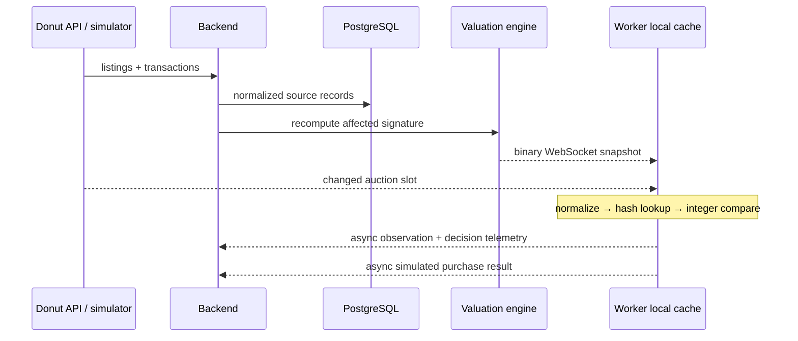

# Architecture

The system is a modular monolith plus independently runnable collector, simulator, load generator, dashboard, and Fabric client. The monolith avoids premature distributed coordination while package boundaries preserve future split points.

## Runtime data flow

### Critical-path invariant

A worker never asks the backend to value an observed listing. `PriceSnapshotCache` atomically replaces an immutable map and `Evaluate` performs one lookup plus integer comparisons. Network and disk work happen after the decision.

### Backend modules

- `market`: canonical identity, FNV-1a fingerprints, transaction/listing state, stale-listing expiry, exact/base fallback models, robust statistics, snapshot versioning.
- `network`: binary framing, three priority classes, bounded queues, chat isolation, worker scoring.
- `platform`: validation, authentication, rate limiting, HTTP routes, WebSocket sessions, metrics and dashboard projections.
- `persistence`: PostgreSQL source-record storage and bounded startup history restore.
- `donutapi`: current official API mapping, authentication, pagination, rate control, retries and response bounds.

### Failure behavior

- Database failure returns `503` rather than acknowledging unpersisted official ingest.
- Slow WebSocket clients have bounded queues. P2 chat is discarded before P0/P1 market data; a client unable to accept critical frames is disconnected and recovers from a full snapshot.
- Snapshots are versioned; clients reject older versions and receive a new full snapshot after reconnect. Read endpoints require a worker or admin token as appropriate.
- Active asks expire at an explicit deadline or a bounded fallback TTL; `LISTING_GONE` removes them immediately.
- The browser calls a same-origin dashboard proxy, which supplies the admin credential server-side.
- A stale cache is explicit. Safe purchase adapters revalidate sync ID, slot, signature, seller and price.
- Malformed, oversized and unauthorized input is rejected before reaching the market engine.

### Scaling path

The first scale boundary is PostgreSQL write batching/partition maintenance, followed by snapshot serialization and single-node fanout. At that point: partition observations monthly, batch with `COPY`, store encoded snapshot blobs, add a NATS-backed event bus behind the hub interface, and run stateless gateways. The client remains unchanged.
